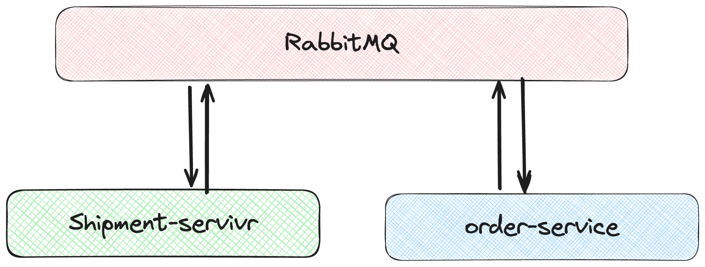

# E Commerce Store
#### Table of Contents
- Background
- Modules
    - Order Service
    - Payment Service
    - Product Service
    - Shipment Service
    - User Service
    - Service Registry
- Entity Relationship for Store Service
- Microservices Architecture
- API Endpoints
- RabbitMQ Integration
- Dependencies
- API Endpoints
- Error Handling
- Contributing
- License
---
### Background

The E-Store backend application is designed to manage the operations of an e-commerce platform, providing services related to products, orders, payments, inventory, and shipments. It is built using Spring Boot and employs a microservices architecture to ensure scalability and maintainability.

---

### Modules

- Store Service - Like Catalog
- Order Service
- Payment Service
- Shipment Service
- User Service
- Service Registry 

---

#### Entity Relationship for Store Service

### HighLevel View of Microsevices (online - store - payment -shipment )

---
### API Endpoints
- [Store - sevice endpoints](http://localhost:1727/swagger-ui/index.html#/)

- [User - sevice endpoints](http://localhost:1737/swagger-ui/index.html#/)

- [Order - sevice endpoints](http://localhost:8010/swagger-ui/index.html#/)

- [Payment - sevice endpoints](http://localhost:8088/swagger-ui/index.html#/)

- [Shipment - sevice endpoints](http://localhost:9087/swagger-ui/index.html#/)

### RabbitMQ Integration

##### What is RabbitMQ
a distributed message broker that collects streaming data from multiple sources to route it to different destinations for processing.

##### What is used for?

RabbitMQ is used for asynchronous communication between microservices. Each service publishes and subscribes to events through RabbitMQ, ensuring loose coupling and reliable message delivery.

𝙎𝙮𝙣𝙘𝙝𝙧𝙤𝙣𝙤𝙪𝙨 𝘾𝙤𝙢𝙢𝙪𝙣𝙞𝙘𝙖𝙩𝙞𝙤𝙣 vs A𝙎𝙮𝙣𝙘𝙝𝙧𝙤𝙣𝙤𝙪𝙨 𝘾𝙤𝙢𝙢𝙪𝙣𝙞𝙘𝙖𝙩𝙞𝙤𝙣

1. 𝙎𝙮𝙣𝙘𝙝𝙧𝙤𝙣𝙤𝙪𝙨 𝘾𝙤𝙢𝙢𝙪𝙣𝙞𝙘𝙖𝙩𝙞𝙤𝙣: Real-time interaction, often through HTTP requests or RPC mechanisms. Simple but may introduce coupling.

2. 𝘼𝙨𝙮𝙣𝙘𝙝𝙧𝙤𝙣𝙤𝙪𝙨 𝘾𝙤𝙢𝙢𝙪𝙣𝙞𝙘𝙖𝙩𝙞𝙤𝙣: Decoupled communication via message brokers or event buses. Promotes loose coupling and scalability.
